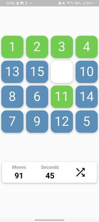

# 15 Puzzle Game

This is a simple implementation of the classic 15 Puzzle game using Flutter.

## Game Rules

The 15 Puzzle game consists of a frame of 4x4 numbered square tiles in random order with one tile missing. The objective of the puzzle is to place the tiles in order by making sliding moves that use the empty space.

## Play it
[Play in the web browser](https://berkayceylan.github.io/15_puzzle#/)  
[Play in the android](https://play.google.com/store/apps/details?id=com.berkayceylan.fifteen_puzzle)

## Can Build For

IOS, Android, MacOS, Linux, Windows, Web 

## Getting Started

1. Clone the repository: `git clone https://github.com/berkayceylan/15_puzzle_flutter.git`
2. Navigate to the project directory: `cd 15_puzzle_game`
3. Install the dependencies: `flutter pub get`
4. Run the app: `flutter run`

## Screenshots

</img>
</img>
</img>
</img>

## Features

- Shuffle the puzzle tiles with the click of a button.
- There isn't unsolvable bug.
- Move tiles by tapping on them.
- See the number of moves you have made.
- See how much time you have spent solving the puzzle.
